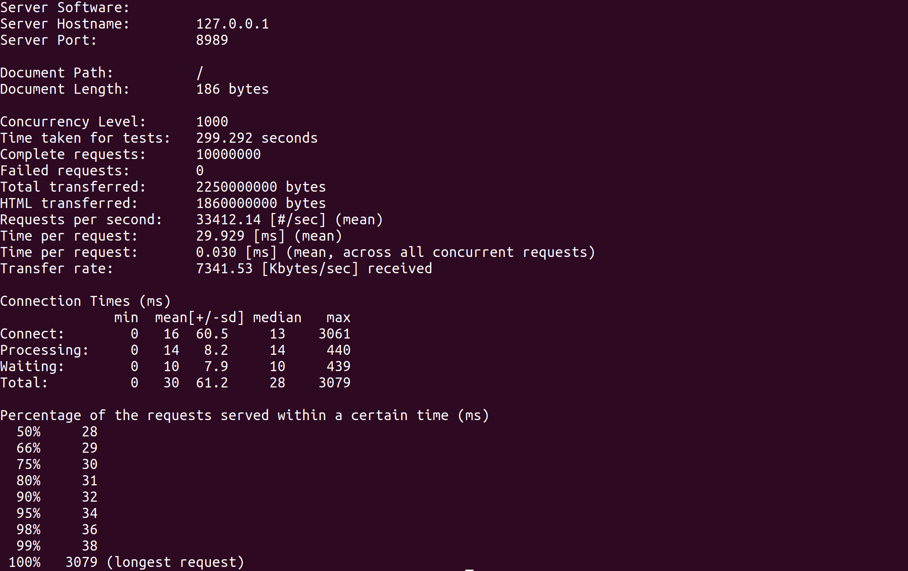
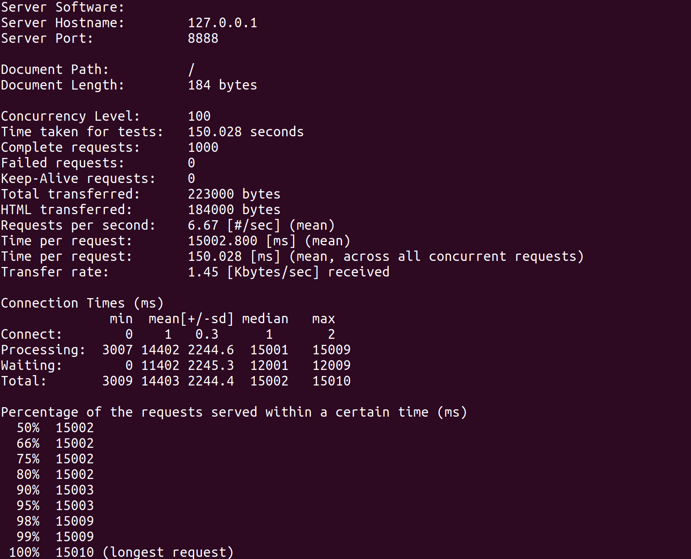

# 简易HTTP服务器

`src`文件夹下 基于线程池和epoll实现

`demo`文件夹下 基于线程池实现，没有epoll

通过对比，可以发现使用epoll实现I/O多路复用后，测试速度要快很多

epoll实现边缘出发，当有请求到来时，检查相应的套接字是否在工作队列中，若不在，则将它加入到工作队列中，等待处理

##  epoll测试

使用Apache bench进行并发数为1000，请求数为10000000的测试

先前出现了测试了一定数量的请求后，再次请求返回`404 Not Found`的情况，经过检查，发现是打开的文件描述符都没有关闭，导致后面的文件打开操作都失败了

我的电脑最多只能使用1000的并发数，原因是不能同时打开更多的文件

## 非epoll测试

使用Apache bench进行并发数为100，请求数为1000的测试

**虽然性能有了质的飞越，但是我的epoll封装的不太好，需要后序学习了大牛写的代码后再进行改进**

**详细介绍请阅读博客：[HTTP WebServer](https://blog.csdn.net/dsaaf21/article/details/106229185)**

